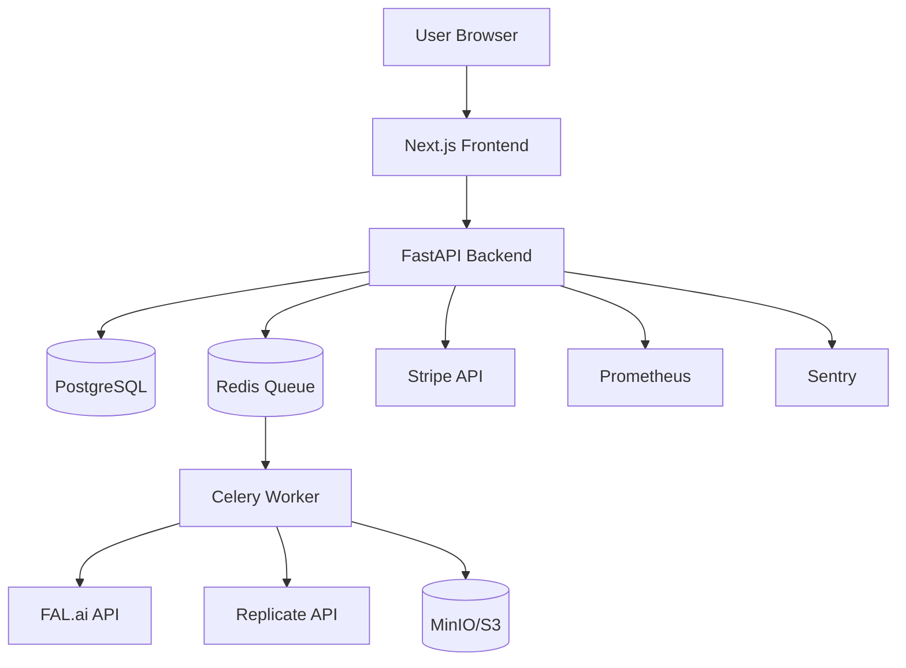
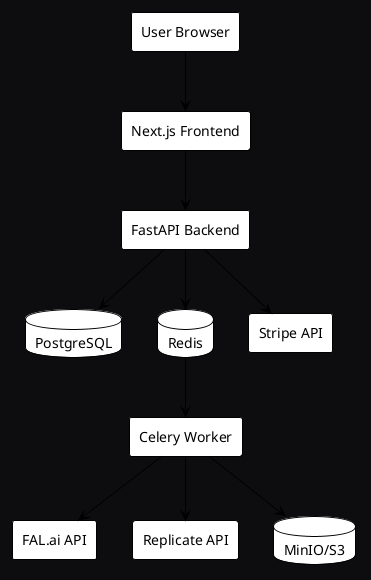

# Architecture Diagram Creation Guide

## Current Status

- ✅ Text-based diagram created: `docs/system_architecture.txt`
- ⏳ Visual PNG diagram pending: `docs/system_architecture.png`

## Diagram Requirements

The architecture diagram should visualize:

1. **Component Map**:
   - Frontend (Next.js)
   - Backend (FastAPI)
   - Database (PostgreSQL)
   - Queue (Redis)
   - Workers (Celery)
   - Storage (MinIO/S3)
   - External APIs (FAL.ai, Replicate, Stripe)

2. **Request Flow**:
   - User → Frontend → API → Queue → Worker → AI Provider → Storage
   - Show data flow with arrows
   - Include status transitions

3. **Visual Style**:
   - Clean, modern design
   - Use brand colors (Forge Black, Graphite Gray, Forge Amber, Resonance Blue)
   - Clear labels and connections
   - Professional appearance suitable for documentation

## Creation Options

### Option 1: Mermaid Diagram (Recommended)

Create a Mermaid diagram and convert to PNG:



**Tools**:
- Mermaid Live Editor: https://mermaid.live/
- Export as PNG/SVG
- Or use `@mermaid-js/mermaid-cli` to generate PNG

### Option 2: Draw.io / Diagrams.net

1. Use the text diagram as reference
2. Create visual diagram in Draw.io
3. Export as PNG (1920×1080px recommended)
4. Save to `docs/system_architecture.png`

### Option 3: PlantUML

Create PlantUML diagram and render to PNG:



### Option 4: Manual Creation

Use design tools (Figma, Adobe Illustrator, etc.):
1. Reference the text diagram
2. Create visual representation
3. Export as PNG
4. Ensure high resolution (at least 1920px width)

## Quick Command (Mermaid CLI)

If you have Node.js installed:

```bash
npm install -g @mermaid-js/mermaid-cli

# Create mermaid file
cat > docs/system_architecture.mmd << 'EOF'
graph TB
    User[User Browser] --> Frontend[Next.js Frontend]
    Frontend --> API[FastAPI Backend]
    API --> DB[(PostgreSQL)]
    API --> Redis[(Redis Queue)]
    Redis --> Worker[Celery Worker]
    Worker --> FAL[FAL.ai API]
    Worker --> REP[Replicate API]
    Worker --> S3[(MinIO/S3)]
EOF

# Generate PNG
mmdc -i docs/system_architecture.mmd -o docs/system_architecture.png
```

## Update README

Once the PNG is created, the README will automatically display it (already referenced in the Architecture section).

## Current Reference

See `docs/system_architecture.txt` for the text-based diagram that serves as the reference for the visual diagram.

